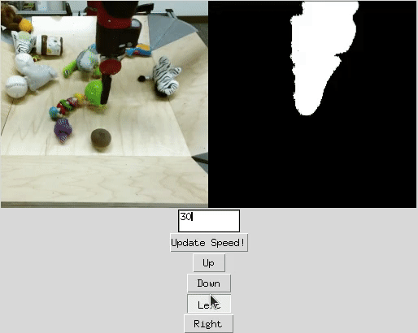

# Layered Controllable Video Generation 
[Jiahui (Gabriel) Huang](https://scholar.google.com/citations?user=qWU4y1wAAAAJ&hl=en),
[Yuhe Jin](https://scholar.google.ca/citations?user=oAYi1YQAAAAJ&hl=en),
[Kwang Moo Yi](https://scholar.google.com/citations?user=pr6rIJEAAAAJ&hl=en),
[Leonid Sigal](https://scholar.google.com/citations?user=P2mG6rcAAAAJ&hl=en)<br/>
#### ECCV 2022 (Oral)



We introduce layered controllable video generation, where we, without any supervision, decompose the initial frame of a video into foreground and background layers, with which the user can control the video generation process by simply manipulating the foreground mask.

[arXiv](https://arxiv.org/abs/2111.12747) | [BibTeX](#bibtex) | [Project Page](https://gabriel-huang.github.io/layered_controllable_video_generation/)


## Requirements
A suitable [conda](https://conda.io/) environment named `control` can be created
and activated with:

```
conda env create -f environment.yaml
conda activate control
python setup.py install
```

## Running the demo

First, download the inference model [here](https://drive.google.com/file/d/1yI31YeBh0PYsf_-jJkIFf1d85jHKyaVo/view?usp=sharing), and put it in `checkpoints/`

To run demo:

```
python demo.py
```

## Training your own model on BAIR

Training on your own dataset can be beneficial to get better tokens and hence better images for your domain.
Those are the steps to follow to make this work:
1. download full resolution BAIR Robot Pushing dataset from [here](https://drive.google.com/file/d/1rxp_PenuctchTUzA0Tp_wO-CdfxOB73F/view).
2. extract the data, it should have the following structure:

   ```
   $ data_path/{split}/
   ├── vid1
   │   ├── 00000.png
   │   ├── 00001.png
   │   ├── ...
   ├── vid2
   │   ├── 00000.png
   │   ├── 00001.png
   │   ├── ...
   ├── ...
   ```
   where `{split}` is one of `train`/`test`
3. create 2 text files a `xx_train.txt` and `xx_test.txt` that point to the files in your training and test set respectively. you can use the helper function:

   `python scripts/make_txt.py --data_path <your data path>`
4. adapt `configs/bair.yaml` to point to these 2 files
5. run `python main.py --base configs/bair.yaml -t True --gpus 0,1` to
   train on two GPUs. Use `--gpus 0,` (with a trailing comma) to train on a single GPU.


## BibTeX

```
@misc{huang2020control,
      title={Taming Transformers for High-Resolution Image Synthesis}, 
      author={Jiahui Huang and Yuhe Jin and Kwang Moo Yi and Leonid Sigal},
      year={2022},
      eprint={2111.12747},
      archivePrefix={arXiv},
      primaryClass={cs.CV}
}
```